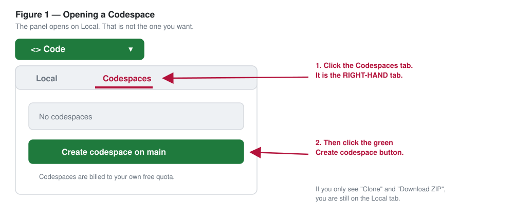
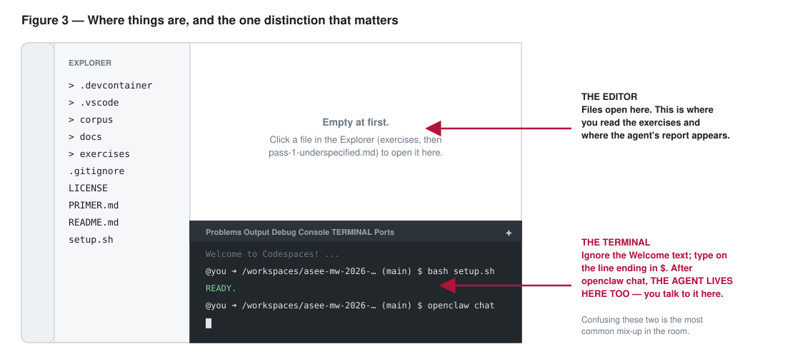
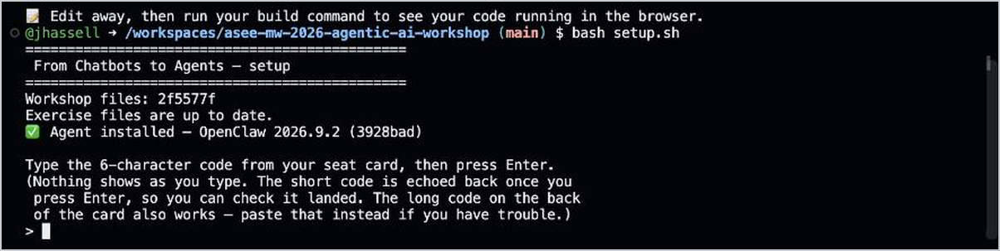
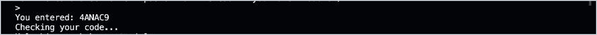
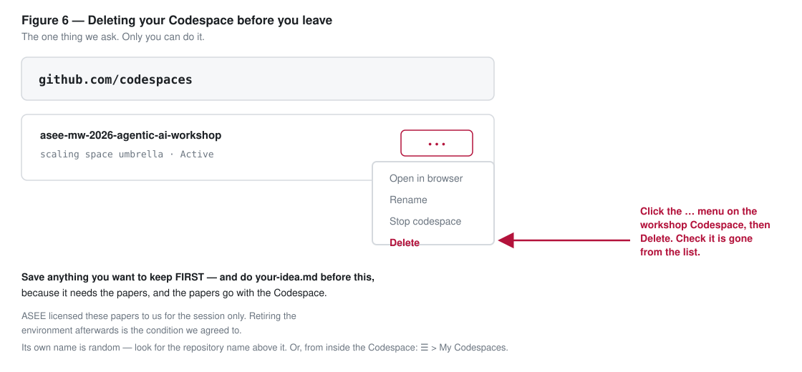

# From Chatbots to Agents

### A Hands-On Workshop on Teaching with Agentic AI

**2026 ASEE Midwest Section Conference** · University of Oklahoma, Norman ·
September 13–15, 2026
Facilitator: John Hassell, OU Polytechnic Institute — Chair, ASEE Midwest Section

---

## Before you arrive (about 5 minutes)

You need two things. Please do both **before** the session — conference wifi
is not the place to create an account for the first time.

**1. A free GitHub account.**
If you don't have one: <https://github.com/signup>. Any email works. You do
not need a paid plan, and you will not be asked for a credit card.

**2. Confirm you can open a Codespace.**
Sign in to GitHub, come back to this page, and click the green **Code** button
at the top right of the file list. A small panel drops down with **two tabs**:

> **Local**  |  **Codespaces**   ← click the **Codespaces** tab, on the right

The panel opens on **Local** by default, which offers to clone the repository
to your laptop. That is *not* what you want. Click **Codespaces**, then
**Create codespace on main**.



A browser-based editor opens and spends a minute or two building. When the terminal first tries to start, a box asks **"Do you trust the authors of the files in this
folder?"** Click the green **Trust Folder & Continue** button — these are the
workshop's own files. (Until you answer, the terminal stays blank and you will see *Restricted Mode* —
in a banner across the top and in the bottom bar. Clicking Trust Folder &
Continue clears both.)


That's it — you can close the tab again. Doing this once ahead of time means
you walk into the room with a working environment instead of a signup form.

You do **not** need to install anything on your laptop. You do **not** need
an API key of your own — one is provided at the session.

**Optional, ten minutes, genuinely worth it:** [`PRIMER.md`](PRIMER.md) explains
what you are actually going to be using — what an agent is (and why the experts
still disagree), why it is not a chatbot, what a *harness* is and why that may
be a new engineering discipline, what GitHub and Codespaces and OpenClaw are,
and where all of this appears to be heading. Most of this vocabulary, in the
sense used here, is only a year or two old, so nobody should feel behind. You
can also read it afterwards — there is a printed short version on your chair.

Bring a laptop that can run a modern browser (Chrome, Edge, Firefox, or
Safari) and that you can type on comfortably for 90 minutes.

---

## At the workshop

You'll receive a **seat card**. It has a **6-character code** on the front, and
a long code on the back that does the same job if the short one gives trouble.
Then:

0. Join the **OUGuest** wifi. A browser page asks you to accept the terms;
   accept, then check that <https://github.com> loads.

1. Open your Codespace: green **Code** button → **Codespaces** tab (the
   right-hand tab, not **Local**). If you made one before the session, it is
   listed there under a made-up name like *scaling space umbrella* — click it.
   Click **Create codespace on main** only if the list is empty. When the
   terminal first tries to start and asks whether you trust the authors of the files in this
   folder, click the green **Trust Folder & Continue** button.

2. A terminal is already open across the bottom of the window. If you don't
   see one, or you close it by accident: click the **+** at the top right of
   the terminal panel (if the whole panel is gone: the **☰** menu at the top
   left, then **Terminal → New Terminal**). In it, run:

   ```bash
   bash setup.sh
   ```

   If it stops and tells you to re-run it, run `bash setup.sh` once more. That
   is expected with a Codespace made before the conference.



3. When it asks for the workshop code, type the **6 characters** from the front
   of your seat card and press Enter. Two things are worth knowing:

   - **Nothing appears on the screen as you type.** No dots, no asterisks, no
     movement at all — the code is hidden so it can't be read off your screen.
     It *is* going in, and the script **echoes it back to you** as soon as you
     press Enter so you can check it landed.
   - Capitals don't matter, and common misreads (a `G` for a `6`) are forgiven.



   After you press Enter, the code is echoed back so you can check it landed:



   If it isn't accepted, the script asks again on the spot; you don't start
   over. If it still won't take, **turn the card over and type the long code
   at the same prompt** — carefully, capitals matter in that one. It skips the
   code service and goes straight to GitHub. The script replies with how many
   characters it received.

4. Wait for **READY**. This takes a few seconds.

5. Start the agent:

   ```bash
   openclaw chat
   ```

6. In the file list on the left, click **exercises**, then
   **pass-1-underspecified.md**. It opens in the large area above the terminal.
   Read there; type and paste only in the terminal.

The setup step downloads the workshop paper corpus and configures the agent
for you. If anything fails, it will tell you exactly what to do next — and
raising a hand is always a valid next step.

---

## What is this stuff?

If "agent," "harness," "Codespace" or "OpenClaw" are new to you, that is the
normal condition, not a gap — most of these words, in the sense used here,
are only a year or two old.
[`PRIMER.md`](PRIMER.md) is a ten-minute read that explains all of them in
plain terms, including the honest admission that there is no settled definition
of "agent" even among the people building these things.

The one-line version: **Agent = Model + Harness.** The model decides; the
harness gives it hands, a place to act, and limits. A chatbot has no harness,
which is why nothing happens between your turns.

---

## What we're doing

You'll run one task three times against a corpus of engineering-education
papers, and watch the output change:

1. **Underspecified.** A vague prompt. Confident, readable, and nothing in it you can check.
2. **Specified.** The same task with explicit scope, format, and acceptance
   criteria, one of which you write yourself. The difference is visible
   immediately.
3. **Verify.** If you don't check the agent's work against something
   outside the agent, you will confidently report things that aren't true.

Then you write one change to one assignment you teach, and the rubric line
that grades it. The files are in [`exercises/`](exercises/).

Three passes and one change — that is the whole session. It is short on
purpose. Pointing the agent at your *own* paper or course is the first thing
to do afterwards, and [`exercises/your-idea.md`](exercises/your-idea.md) walks
you through it in about ten minutes.

The takeaway is not "AI is good" or "AI is bad." It's that **a fluent answer is
not the same as a trustworthy one.** Trustworthy work from an agent takes three
habits — specifying what you want, supervising while it runs, and verifying the
result against something outside the agent. The third is the one people skip,
and it is the one pass 3 exists to make unskippable. All three are teachable,
and all three are habits your students need.

---

## About the papers

The corpus is drawn from the [ASEE PEER repository](https://peer.asee.org).
ASEE granted permission on 2026-08-26 for use in this workshop specifically:
private, temporary, per-participant environments, for the duration of the
session, with attribution and copyright retained.

The papers are **not** stored in this repository. They are downloaded into
your own Codespace at setup and disappear with it. Please don't redistribute
them. Papers remain © the American Society for Engineering Education and
their respective authors.

Your Codespace is yours alone — no one else can see it.

**Before you leave the conference, please delete it.** This is the one thing we
ask of you. Your Codespace holds ASEE-licensed papers and a temporary workshop
credential, and ASEE's permission is conditioned on those environments being
retired after the session. Nobody but you can delete it — it lives in your
account, not ours.

1. Save anything you want to keep: your report, your brief, your notes
   (right-click a file in the list on the left, then **Download**).
2. Go to <https://github.com/codespaces>.
3. Find the one listed under **jhassell/asee-mw-2026-agentic-ai-workshop** (its
   own name is random, like *scaling space umbrella*), click its **…** menu,
   choose **Delete**, and check that it is gone from the list.



Everything you need to build the same environment again with your own key and
your own documents is in `exercises/keep-it-running.md`, and none of it depends
on this Codespace surviving.

---

## Trouble?

| What you see | What to do |
|---|---|
| The **Code** button only offers to clone or download | You're on the **Local** tab, or not signed in. Click the **Codespaces** tab beside it; if there is no such tab, sign in first (top right). |
| "Do you trust the authors of the files in this folder?" | Click the green **Trust Folder & Continue**. These are the workshop's own files. |
| The bottom bar says **Restricted Mode** and the terminal stays blank | You clicked **Cancel** on that prompt. Click **Restricted Mode** in the bottom bar, then **Trust**. |
| Chrome asks to see your clipboard | Click **Allow** — that's how the paste reaches the terminal. |
| The terminal warns you about pasting | Choose the option that pastes anyway. |
| Nothing appears when you type the code | Expected. The code is hidden on purpose. Press Enter and the script echoes it back to you. |
| The 6-character code isn't accepted | Check it against the card, then try again — the script asks again in place. Still no? Turn the card over and type the long code at the same prompt; it does not need the code service. |
| "Could not reach the code service" | Run `bash setup.sh` again and type the long code from the back of the card. |
| You closed the terminal | Click the **+** at the top right of the terminal panel, or **☰** → **Terminal** → **New Terminal**. |
| `bash: setup.sh: No such file or directory` | You're in the wrong folder. Run `cd /workspaces/asee-mw-2026-agentic-ai-workshop` and try again. |
| `openclaw: command not found` | Run `bash setup.sh`. It installs the agent itself if the container didn't. |
| Codespace won't start | At <https://github.com/codespaces>, delete only an earlier Codespace made from **this** repository (asee-mw-2026-agentic-ai-workshop), then create a new one. Leave any other Codespaces alone. |
| Anything else | Raise a hand. |

---

## License

Workshop materials in this repository are released under the MIT License
(see `LICENSE`). **This does not apply to the ASEE PEER papers**, which are
separately licensed and not distributed here.
