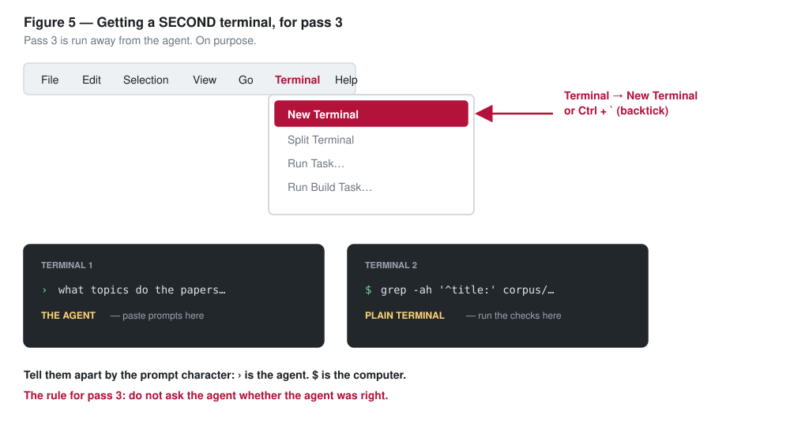

# Pass 3: check before you believe

The rule for this pass: **do not ask the agent whether the agent was
right.** Check the world instead.

First, get a terminal that is not the agent. Click the **+** at the top
right of the terminal panel (or open the **☰** menu at the top left, then
**Terminal → New Terminal** — there is no menu bar in the browser). A second
terminal opens whose last line ends in `$`. Type here, not at the agent.

The agent's conversation will seem to disappear. It is still running: a list
of your terminals appears at the right edge of the panel, and clicking an
entry switches between them.



## Move 1: inside the folder (in the plain terminal)

Copy, paste, Enter. If two files share a title, both filenames print:

```
grep -ah '^title:' corpus/papers/*.md | sort | uniq -d | while IFS= read -r t; do grep -alF -- "$t" corpus/papers/*.md; done
```

Then this one, which prints each of those files' ID lines — the `paper_id` at
the top and the "Paper ID" in the body:

```
grep -ah '^title:' corpus/papers/*.md | sort | uniq -d | while IFS= read -r t; do grep -alF -- "$t" corpus/papers/*.md; done | xargs -r grep -aiE 'paper[_ ]id'
```

Do they agree? Now look at your `coverage-report.md`: how many papers did it
count, and are both of these files in the same theme?

## Move 2: outside it (in a new browser tab)

Look at section 4 of your report, "Claims worth verifying." Take the paper
ranked first, the one you would cite tomorrow. Copy its title. In a new
browser tab, go to <https://peer.asee.org> and search for that title. Then
search for the first author's name, which section 4 of your report lists. If there is time before the facilitator
calls the room together, do the same for the paper ranked second.

## The whole workshop, in three words

**Source** — does it exist? (the PEER search)
**Claim** — does it say that? (the number your report quoted really is in that paper's file)
**Evidence** — is that enough to believe it? (neither check tells you)

Big numbers in an abstract are a reason to read the methods, not a reason to
trust them. And if a search finds nothing, write **"not verified," not
"fake"** — a search can miss a real paper. What makes something fake is
evidence, and you will hear some shortly.

PEER is today's authority only because these are ASEE papers. **The habit
travels; the website does not.** So, on line 2 of your exit card:

> In my field, I would check against ________ instead.

Crossref, a patent database, a standards body, a trial registry, the source
code, the dataset, the statute, the vendor's own docs. Anything the agent did
not hand you.

Also on line 2: the claim you checked and what you found. Line 3: what your
report now has to say instead.

## When the facilitator says so: correct the folder

Never build anything else on a folder you know is contaminated. In the
plain terminal, remove the files the room has just agreed are defective,
using their real filenames, then count again. Replace FIRST-NUMBER and
SECOND-NUMBER with the two numbers the facilitator names, so the line reads
like `rm corpus/papers/12345.md corpus/papers/67890.md`:

```
rm corpus/papers/FIRST-NUMBER.md corpus/papers/SECOND-NUMBER.md
ls corpus/papers | wc -l
```

Write the new count on line 3 of your exit card. Anything in your report
that depended on the removed files has to be re-derived or withdrawn.

## If this went wrong

- The agent answered instead of printing filenames: you pasted into the agent.
  Click the plain terminal in the list at the right of the terminal panel (or
  the **+** for a new one) and paste again.
- You do not know which paper your report ranked first: open
  `coverage-report.md` and read section 4.
- peer.asee.org is slow on the conference wifi: try
  <https://scholar.google.com> with the title in quotes.
